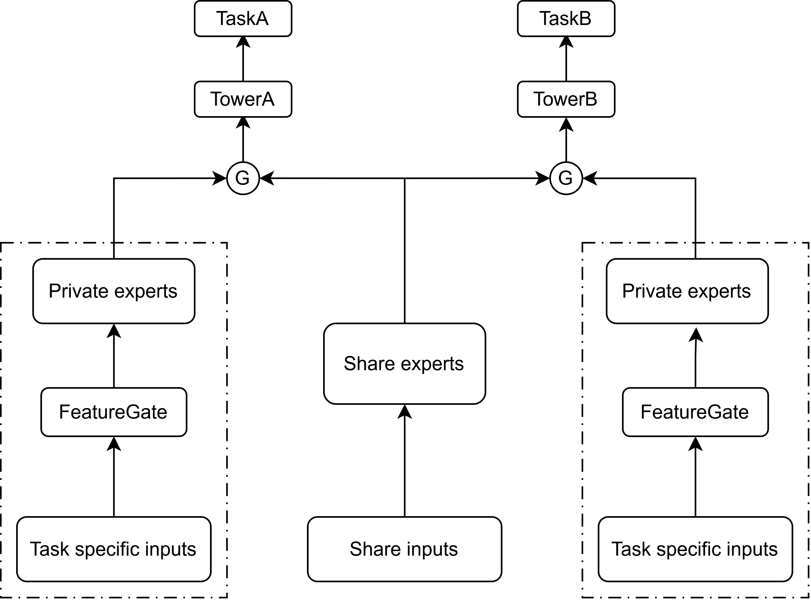

# **HFS-OPE (Hybrid Feature Selection Optimized Private Expert Model)**

## **1. Introduction**

Developed an enhanced multi-task learning model based on the PLE framework to address negative transfer and improve task-specific representation quality.

### **Key Features**

- **Independent Embeddings**: Constructed task-specific and shared embeddings for each feature, providing sufficient parameter space to capture task-level personalized patterns.

- **Hybrid-granularity Feature Selection**: Used PLE-based offline feature importance to identify task-relevant features, and introduced a FeatureGate module to apply dimension-wise soft masking on task-specific embeddings.

## **2. Model Architecture**


## **3. Requirements**
- **numpy**
- **torch**
- **pandas**
- **scikit-learn**

## **4. Getting start**
```
python main.py \
--task_name=census_income \
--seed=42 \
--model_name=esmm \ #mmoe、ple、hfs_ope
--train_batch_size=1024 \
--val_batch_size=1024 \
--test_batch_size=1024 \
--device=cuda \
--mtl_task_num=2 \
--model_path='/share/home/u17518/yhn/application/HFS-OPE_v2/experiments/census_income_ple_seed42_best_model_2.pth' # use it when model_name = hfs_ope
```


## **5. Datasets**
| Name | Instances | Features | Labels | link |
|----------|----------|----------|----------|----------|
| census-income   | 299285  | 42  | 2  |https://archive.ics.uci.edu/dataset/117/census+income+kdd|

| Name | users | items | interactions | Features | link |
|----------|----------|----------|----------|----------|----------|
| TenRec   | 1M  | 1,948,388  | 86,642,580  |5 + User's last 10 interactions|https://tenrec0.github.io/|

## **6. Results**
### **census-income**
| Models | Task1AUC | Task2AUC |
|----------|----------|----------|
| ESMM   | 0.986   | 0.911   |
| MMOE   | 0.979   | 0.938   |
| PLE   | 0.982   | 0.935   |
| **HFS-OPE**   | **0.995**   | **0.947**   |

### **TenRec**
| Models | click-AUC | like-AUC |
|----------|----------|----------|
| ESMM   | 0.559   | 0.922   |
| MMOE   | -   | -   |
| PLE   | -   | -   |
| HFS-OPE   | -   | -   |

(is coming soon)
