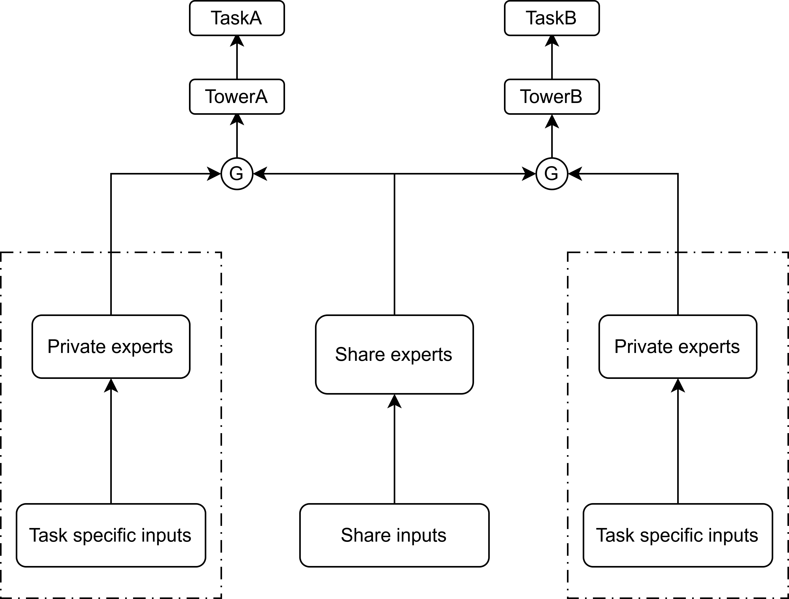

# **KuaiRand-MultiTask-Ranking**

## **1. Introduction**

Multi-task learning plays a crucial role in modern recommender systems, especially in short-video platforms where user behavior is diverse and sparse across different interaction types. The KuaiRand dataset provides large-scale logs from Kuaishou’s single-column and double-column recommendation scenarios, containing one month of user interactions such as click, like, comment, follow, and long-view.

Building on this dataset, we develop a multi-task learning framework to jointly model key user behavior probabilities (e.g., pCTR, pVTR). To overcome the limitations of traditional manual fusion rules used in industry, we further introduce learning-based ensemble methods to adaptively fuse multi-task predictions. By leveraging user-specific and task-specific representations, our approach learns personalized fusion weights, significantly enhancing ranking effectiveness in the fine-ranking stage.

### **Key Features**

- **Imbalanced Multi-Behavior Modeling**: Applying positive oversampling to enhance gradient signals for sparse tasks, and by replacing BCE with Focal Loss for extremely sparse behaviors to emphasize hard-sample learning. 

- **Optimized Private Expert**: Developing a Optimized Private Expert(OPE) model to introduce task-specific embeddings and feature-selection mechanisms to improve personalization and reduce unnecessary memory overhead.

- **Learning-based ensemble method**: Adopting LR/MLP as learnable weight models and incorporate ideas from **aWELv** to build user embeddings and task embeddings, using their inner product produces as user-level fusion weights.

## **2. OPE Model Architecture**


## **3. Requirements**
- **numpy**
- **torch**
- **pandas**
- **scikit-learn**

## **4. Getting started**
**Training an OPE model**
```
python main.py \
--seed=42 \
--task_name=kuairand_1k \
--model_name=ope \
--dataset_path='' \
--lr=0.0001 \
--loss_fn='weighted_bce' \
--device=cuda \
--train_batch_size=4096 \
--val_batch_size=4096 \
--test_batch_size=4096 \
--epochs=50 \
--click_neg_ratio=1.0 \
--pos_weight 1.0 10.0 20.0 40.0 40.0 1.0 \
--task_loss_weight 1.0 0.8 0.7 0.6 0.6 1.0 \
--task_cols is_click is_like is_comment is_follow is_forward long_view \
--ope_num_shared_experts=2 \
--ope_num_specific_experts=2 \
--ope_num_levels=2 \ 
--top_n_feature_num=5 \
--embedding_size=64 \
--mtl_task_num=6 \
--ple_model_path=''
```
**Scores fusion**
```
python main.py \
--seed=42 \
--is_ensemble_rank \
--train_batch_size=4096 \
--epochs=50 \
--ope_num_shared_experts=2 \
--ope_num_specific_experts=2 \
--ope_num_levels=2 \
--ope_model_load_path='/share/home/u17518/yhn/application/HFS_OPE_v4/experiments/kuairand_1k_ope_seed42_best_model_6.pth' \
--top_n_feature_load_path='/share/home/u17518/yhn/application/HFS_OPE_v4/experiments/feats_importance.csv' \
--top_n_feature_num=5 \
--embedding_size=64 \
--mtl_task_num=6 \
--ensemble=awelv \
--pxtr_load_path='/share/home/u17518/yhn/application/HFS_OPE_v4/experiments/pxtrs.csv' \
--cal_diversity \
--diversity_alpha=1e-6
```
